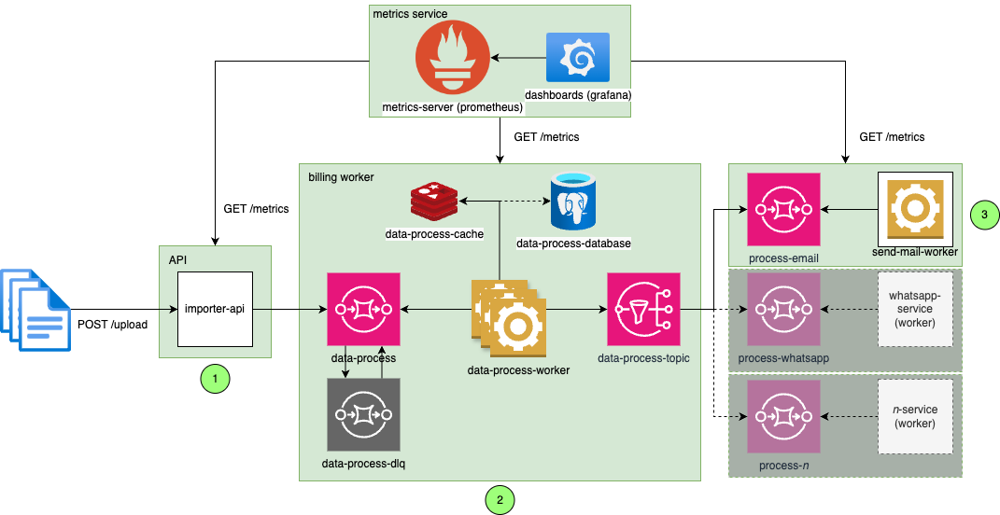
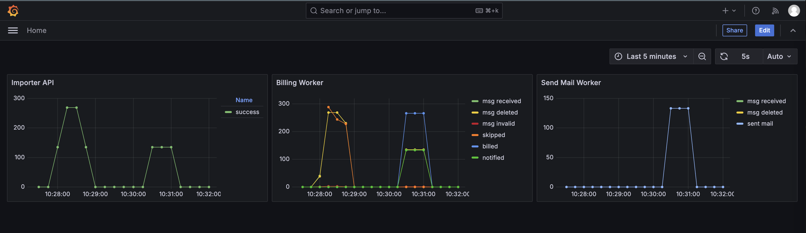

# kanastra-swe-challenge

[](https://github.com/br-monteiro/kanastra-swe-challenge/actions/workflows/unit-tests.yaml)

Este repositório contém a solução para o desafio de Engenharia de Software da Kanastra

## Dependências

- Docker
- Docker Compose
- Python 3.12+ (development/debugging)

## Arquitetura

<p align="center">
  
</p>

## Desafio proposto

Desenvolver uma aplicação que processe um arquivo CSV com informações de clientes e gere boletos para cobrança e dispare mensagens para os e-mails da lista.

Referência: [Desafio Engenharia de Software](https://kanastra.notion.site/Hiring-Challenge-Soft-Engineers-Backend-Take-Home-65cd4195a1ff42f68ff446f8859d2d7f#6636d6e1ad544c78a3158d6da01184be)

## Solução desenvolvida

A solução proposta foi desenvolvida utilizando a linguagem Python e o framework FastAPI para a criação de uma API REST. A aplicação foi containerizada utilizando o Docker e o Docker Compose para facilitar a execução e o deploy da aplicação.
Além disso, pensando na escalabilidade do projeto, a solução foi separada três aplicações distintas. A seguir, uma breve descrição de cada uma delas:

- **importer-api**: responsável por importar o arquivo CSV, através de uma requisição HTTP, e realizar a publicação de mensagens uma fila de mensageria (AWS SQS).
- **billing-worker**: responsável por consumir as mensagens da fila de mensageria (AWS SQS) e gerar os boletos de cobrança, salvar os dados no banco de dados e publicar mensagens com os dados dos clientes para um tópico do AWS SNS.
- **send-mail-worker**: responsável por consumir as mensagens da fila de mensageria (AWS SQS) e enviar os e-mails para os clientes.

> :bulb: A escolha de utilizar o AWS SQS e o AWS SNS foi feita pensando na escalabilidade da aplicação. Com esses serviços, é possível escalar a aplicação de acordo com a demanda, sem se preocupar com a infraestrutura.
> :information_source: Cada aplicação foi desenvolvida em um diretório seperado, mas em um projeto real, cada aplicação seria um repositório separado.

### Como isso funciona?

1. O usuário faz o upload do arquivo CSV através da API REST na rota `POST /v1/upload`.
2. A aplicação `importer-api` recebe a requisição, salva o arquivo no disco e processa o arquivo, enviando pacotes de 10 linhas por vez para a fila de mensageria (AWS SQS).
3. A aplicação `billing-worker` consome as mensagens da fila de mensageria (AWS SQS), transforma os dados em boletos de cobrança e salva os dados no banco de dados para evitar cobranças duplicadas. Após salvar os dados, a aplicação publica uma mensagem com os dados de cobrança para um tópico do AWS SNS.
5. Subscrita ao tópico do AWS SNS, temos uma fila de mensageria (AWS SQS) que é consumida pela aplicação `send-mail-worker`. Esta aplicação é responsável por enviar os e-mails para os clientes.

> :bulb: A decisão de utilizar um tópico do AWS SNS para publicar as mensagens de cobrança foi tomada para que mais serviços possam ser adicionados no futuro, como por exemplo, um serviço de notificação por SMS ou um serviço de notificação por WhatsApp.

### Detalhes das implementações

#### importer-api

A aplicação `importer-api` foi desenvolvida utilizando o framework FastAPI e é responsável por receber o arquivo CSV, processar o arquivo e enviar as mensagens para a fila de mensageria (AWS SQS). Este processamento é feito no background, utilizando um recurso do FastAPI chamado [BackgroundTasks](https://fastapi.tiangolo.com/tutorial/background-tasks/).

Na tarefa de processamento do arquivo, a aplicação lê o arquivo linha a linha e envia um pacote de 10 linhas por vez para a fila de mensageria (AWS SQS). Estas tarefas são executadas assincronamente usando [asyncio](https://docs.python.org/3/library/asyncio.html), permitindo que a aplicação continue recebendo novas requisições enquanto o arquivo é processado.
Para enviar as mensagens para a fila de mensageria, foi utilizado o pacote [boto3](https://boto3.amazonaws.com/v1/documentation/api/latest/reference/services/sqs.html) para interagir com a AWS.

As rotas disponíveis na aplicação são:

- `POST /v1/upload`: rota para fazer o upload do arquivo CSV.
- `GET /health`: rota para verificar a saúde da aplicação.
- `GET /docs`: rota para acessar a documentação da API.
- `GET /metrics`: rota para acessar as métricas exportadas pela aplicação

> :bulb: A rota de upload foi versionada para facilitar a evolução da API. Caso seja necessário fazer alguma alteração na rota, é possível criar uma nova versão da rota sem impactar os clientes que já estão utilizando a API.

Abaixo é possível ver um exemplo de requisição para a rota de upload:

```bash
curl --location --request POST 'http://localhost:8000/v1/upload' \
--form 'file=@"<PATH-PARA-O-ARQUIVO-CSV>"'
```

Onde `<PATH-PARA-O-ARQUIVO-CSV>` é o caminho para o arquivo CSV que será enviado para a aplicação.

> :buld: Para facilitar, temos um arquivo de exemplo em `developer/demmy/input.csv` que pode ser utilizado para testar a aplicação.

##### Métricas exportadas pela importer-api

- `csv_processor_messages_sent`: Número de mensagens enviadas para a fila de mensageria (AWS SQS).
- `csv_processor_messages_failed`: Número de mensagens que falharam ao serem enviadas para a fila de mensageria (AWS SQS).
- `csv_processor_duration_seconds`: Duração do processamento do arquivo CSV em segundos.

#### billing-worker

A aplicação `billing-worker` é responsável por consumir as mensagens da fila de mensageria (AWS SQS), gerar os boletos de cobrança e salvar os dados no **banco de dados***. Após salvar os dados, a aplicação publica uma mensagem com os dados de cobrança para um tópico do AWS SNS.
No momento, a aplicação está configurada para salvar os dados no Redis, mas é possível alterar a configuração para salvar os dados em outro banco de dados, como o PostgreSQL, por exemplo.

No fluxo de processamento, as mensagens são consumidas da fila de mensageria (AWS SQS) e, para cada mensagem, é gerado um boleto de cobrança. Como o fluxo de geração de boletos é uma tarefa complexa, que pode envolver regras de negócio específicos, foi adotado o padrão de projeto [Chain of Responsibility](https://refactoring.guru/pt-br/design-patterns/chain-of-responsibility). Este padrão permite que cada regra de negócio seja implementada em uma classe separada (`Handler`), facilitando a manutenção e a evolução do código.

As regras de negócio para a geração de boletos estão contidas nos seguintes handlers:

- `ContextBuilderHandler`: responsável por construir o contexto para o pipeline de geração de boletos. Este handler também é responsável por validar os dados recebidos da fila de mensageria.
- `CheckBillingHandler`: responsável por verificar se o cliente já possui uma cobrança com o mesmo DebtId. Caso o cliente já possua uma cobrança com o mesmo DebtId, a cobrança é ignorada (SKIPPED).
- `ProcessBillingHandler`: responsável por processar a cobrança, gerar o boleto de cobrança e salvar o processamento no cache (Redis) (PROCESSED).
- `NotificationScheduleHandler`: responsável por agendar o envio de uma notificação para o cliente (SCHEDULED).

A implementação de Handler se parece com isso:

```python
from src.handlers.abstract_handler import AbstractHandler
from src.models.data_context import DataContext
from src.models.sqs_message import SQSMessage
from src.models.data_status import DataStatus


class MyMagicHandler(AbstractHandler):
    def handle(self, sqs_message: SQSMessage,  data_context: DataContext = None) -> DataContext:
        if (data_context.status == DataStatus.INVALID):
            """
            Do some magic with the data_context.bill_details
            """
            data_context.bill_details.debt_amount = 0

        return super().handle(sqs_message,  data_context)
```

Por se tratar de um desafio, as regras de negócio implementadas são simples, mas é possível adicionar novas regras de negócio facilmente, criando novos handlers e adicionando-os ao pipeline execução.

Após o processamento da cobrança, as notificações são enviadas para o tópico do AWS SNS, que é consumido pela aplicação `send-mail-worker` (ou outro serviço de notificação). As mensagens são enviadas assincronamente, permitindo que a aplicação continue consumindo as mensagens da fila de mensageria (AWS SQS).

##### Métricas exportadas pela billing-worker

- `notification_sent`: Número de notificações enviadas para o tópico do AWS SNS.
- `notification_sent_errors`: Número de notificações que falharam ao serem enviadas para o tópico do AWS SNS.
- `sqs_consumer_messages_received`: Número de mensagens recebidas pela fila de mensageria (AWS SQS).
- `sqs_consumer_messages_deleted`: Número de mensagens deletadas pela fila de mensageria (AWS SQS).
- `skipped_messages`: Número de mensagens que foram ignoradas durante o processamento.
- `invalid_messages`: Número de mensagens inválidas recebidas pela fila de mensageria (AWS SQS).
- `billing_processed_successfully`: Número de cobranças processadas com sucesso.
- `messages_processed_successfully`: Número de mensagens processadas com sucesso.
- `messages_processed_errors`: Número de mensagens processadas com erros.

#### send-mail-worker

A aplicação `send-mail-worker` é responsável por consumir as mensagens da fila de mensageria (AWS SQS) e enviar os e-mails para os clientes. As mensagens são consumidas da fila de mensageria (AWS SQS) e, para cada mensagem, é enviado um e-mail para o cliente.

Por se tratar de um desafio, a aplicação foi configurada para apenas logar as mensagens, simunlando o envio de e-mails. No entanto, é possível adicionar a lógica de envio de e-mails facilmente.

##### Métricas exportadas pela send-mail-worker

- `sqs_consumer_messages_received`: Número de mensagens recebidas pela fila de mensageria (AWS SQS).
- `sqs_consumer_messages_deleted`: Número de mensagens deletadas pela fila de mensageria (AWS SQS).
- `messages_processed_successfully`: Número de mensagens processadas com sucesso.
- `messages_processed_errors`: Número de mensagens processadas com erros.
- `mails_sent`: Número de e-mails enviados para os clientes.

## Executando a aplicação

Para facilitar a execução da aplicação, foi criado um arquivo `docker-compose.yml` que contém a configuração dos serviços necessários para executar a aplicação. Para executar a aplicação, siga os passos abaixo:

1. Clone o repositório:

```bash
git clone git@github.com:br-monteiro/kanastra-swe-challenge.git
```

2. Acesse o diretório do projeto:

```bash
cd kanastra-swe-challenge
```

3. Fazer o setup da aplicação:

```bash
make app/setup
```

4. Iniciar a aplicação:

```bash
make app/up
```

Este comando irá iniciar os serviços necessários para executar a aplicação.

Após a execução do comando, a aplicação estará disponível em `http://localhost:8000`.

Caso deseje visualizar os logs das aplicações, execute o comando:

```bash
make app/logs
```

Para parar a execução da aplicação, execute o comando:

```bash
make app/down
```

> :information_source: O nível de log das aplicações foi configurado para `DEBUG`, mas é possível alterar o nível de log para `INFO` no arquivo nos arquivos `.env` de cada aplicação.

## Testes

Para garantir a qualidade do código, foram implementados cerca de **165 testes**, que podem ser executados utilizando os seguintes comandos:

1. Criação das imagens docker usadas nos testes:

```bash
IMAGE_NAME=kanastra-importer-api CONTEXT=importer-api DOCKERFILE=importer-api/Dockerfile make docker/build
IMAGE_NAME=kanastra-billing-worker CONTEXT=billing-worker DOCKERFILE=billing-worker/Dockerfile make docker/build
IMAGE_NAME=kanastra-send-mail-worker CONTEXT=send-mail-worker DOCKERFILE=send-mail-worker/Dockerfile make docker/build
```

2. Execução dos testes:

```bash
IMAGE_NAME=kanastra-importer-api CONTEXT=importer-api make test
IMAGE_NAME=kanastra-billing-worker CONTEXT=billing-worker make test
IMAGE_NAME=kanastra-send-mail-worker CONTEXT=send-mail-worker make test
```

> :bulb: Os testes foram implementados utilizando o framework [pytest](https://docs.pytest.org/en/stable/).
> :information_source: Este mesmo fluxo também é executado no CI/CD, garantindo que o código seja testado antes de ser integrado ao repositório.

## Monitoramento

Para monitorar as aplicações, foram adicionadas métricas que podem ser acessadas através da rota `/metrics` em todas as aplicações.
Essas métricas são consumidas pelo prometheus, que é um sistema de monitoramento e alerta de código aberto.

Para acessar as métricas diretmanet no prometheus, acesse o endereço `http://localhost:9090`.

Para facilitar a visualização das métricas, foi adicionado um dashboard no Grafana, que pode ser acessado através do endereço `http://localhost:3000`, com as seguintes credenciais:

- **Usuário**: admin
- **Senha**: grafana

<p align="center">
  
</p>

## Melhorias futuras

Por se tratar de um desafio, algumas melhorias não foram implementadas, mas são sugeridas para uma aplicação real:

- Usar um banco de dados para armazenar os dados de cobrança, como o PostgreSQL, por exemplo.
- Implementar a lógica de envio de e-mails na aplicação `send-mail-worker`.
- Fazer usdo de uma abordagem mais robusta para o processamento da tarefa de envios de mensagens pela aplicação `importer-api`. Sugiro o udo **Celery** ao invés de **BackgroundTasks**.
- Melhorar a documentação da API, adicionando exemplos de requisições e respostas.
- Melhorar o dashboard do Grafana, adicionando mais métricas e gráficos.
- Criação da infraestrutura da aplicação utilizando o **Terraform**.

## LAUS DEO ∴
